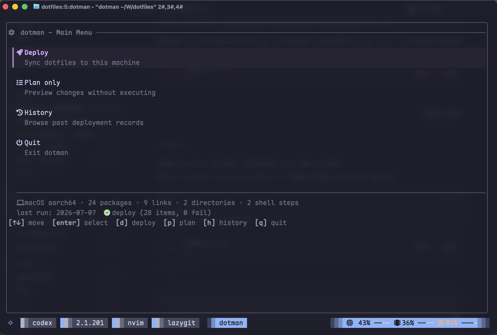
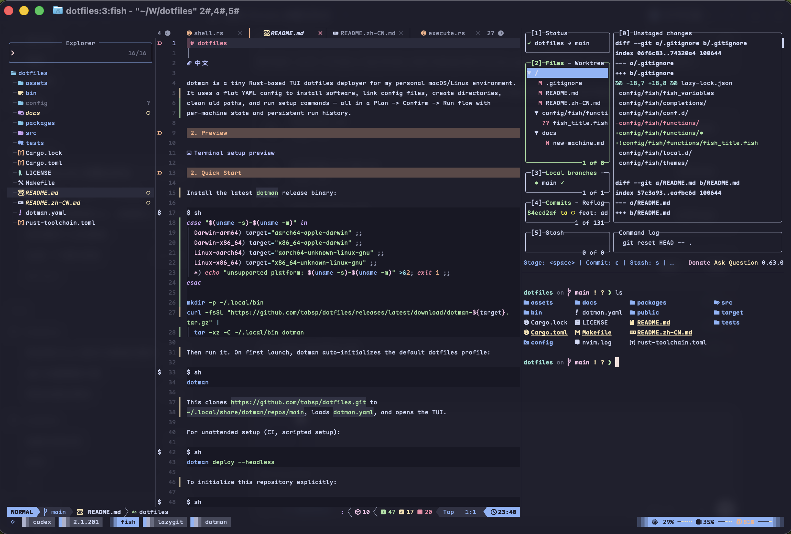

# dotfiles

[中文](README.zh-CN.md)

dotman is a tiny Rust-based TUI dotfiles deployer for my personal macOS/Linux environment.
It uses a flat YAML config to install software, link config files, create directories,
clean old paths, and run setup commands — all in a Plan -> Review -> Run flow with
per-machine state and persistent run history.

## Preview





## Quick Start

Install the latest `dotman` release binary:

```sh
case "$(uname -s)-$(uname -m)" in
  Darwin-arm64) target="aarch64-apple-darwin" ;;
  Darwin-x86_64) target="x86_64-apple-darwin" ;;
  Linux-aarch64) target="aarch64-unknown-linux-gnu" ;;
  Linux-x86_64) target="x86_64-unknown-linux-gnu" ;;
  *) echo "unsupported platform: $(uname -s)-$(uname -m)" >&2; exit 1 ;;
esac

mkdir -p ~/.local/bin
export PATH="$HOME/.local/bin:$PATH"
curl -fsSL "https://github.com/tabsp/dotfiles/releases/latest/download/dotman-${target}.tar.gz" |
  tar -xz -C ~/.local/bin dotman
```

Update an existing installation in place (downloads and verifies the matching GitHub Release asset):

```bash
dotman self update
```

Then run it. On first launch, dotman initializes the default dotfiles profile and
opens the main menu. Choose Deploy, adjust the Plan, then review the selected
actions before starting the Run:

```sh
dotman
```

This clones `https://github.com/tabsp/dotfiles.git` to
`~/.local/share/dotman/repos/main`, loads `dotman.yaml`, and opens the TUI.

For unattended setup (CI, scripted setup):

```sh
dotman deploy --headless
```

Headless mode uses the same execution and result model as the TUI, prints live
action output and a final `ran / changed / no change / failed` summary, saves the
run to history, and exits non-zero for failed or aborted runs.

To initialize this repository explicitly:

```sh
dotman init https://github.com/tabsp/dotfiles.git --branch main --profile main
dotman deploy
```

## Usage

```sh
dotman                       # TUI main menu (auto-inits on first run)
dotman deploy                # TUI: sync → plan → review → run
dotman plan                  # TUI: show plan only, no execution
dotman init [repo]           # initialize a dotfiles profile
dotman sync                  # git pull current profile
dotman status                # show profile and repo state
dotman doctor                # check prerequisites
dotman profile list          # list configured profiles
dotman profile add <name> <repo>
dotman profile remove <name>
dotman history               # TUI: browse past runs
dotman run <ulid>            # TUI: replay a past run
dotman new-link <target> <source>
dotman deploy --headless     # headless: non-interactive deploy
dotman plan --headless       # headless: emit JSON plan to stdout
```

Global options:

```sh
--headless         no prompts; use safe defaults and fail on ambiguity
--bootstrap-git    allow dotman to install git before profile/bootstrap work
--config <path>    use a dotman.yaml directly and bypass profile resolution
--no-init          fail instead of auto-initializing when no config is found
```

## TUI Keys

The footer shows only the primary keys for the current screen:

| Screen | Primary keys |
| --- | --- |
| Main menu | `↑↓` navigate, `Enter` open, `q` quit |
| Plan | `↑↓` navigate, `Space` toggle, `s` save, `r` review, `q` back |
| Review | `↑↓` scroll, `r` run, `q` back |
| Run / Result | `↑↓` scroll, `Tab` filter, `Enter` fold, `f` follow when paused, `q` abort/back |
| History | `↑↓` navigate, `Enter` open, `d` delete, `q` back |
| Run replay | `↑↓` navigate, `Space` fold, `q` back |

Direct main-menu keys (`d` deploy, `p` plan, `h` history), Vim navigation
(`j/k`, `gg`, `G`), `Home/End`, `PageUp/PageDown`, arrow-key filter switching,
and equivalent `Enter`/`Space` actions remain available as unlisted convenience
keys.

Result labels are intentional: **Ran** means a shell command completed;
**Changed** means dotman installed, created, linked, backed up, or cleaned
something. Errors are shown before warnings, while the final run result remains
visible if saving history fails.

## Configuration

Deployment steps live in `dotman.yaml` in your dotfiles repo:

```yaml
package_managers:
  macos: brew
  ubuntu: brew
  arch: pacman

auto_install_pkg_manager: true

default_shell: fish

install: [ghostty, fish, tmux, neovim, lazygit, btop, ripgrep, fzf, starship]

links:
  ~/.config/fish:    config/fish
  ~/.config/nvim:    config/nvim
  ~/.config/ghostty: config/ghostty
  ~/.tmux.conf:      config/tmux.conf

create:
  - ~/.config/fish/local.d
  - ~/Workspace/tries

shell:
  - command: fish -lc 'fisher update'
    description: Sync fish plugins
    optional: true
    if: command -v fish >/dev/null 2>&1

clean:
  - target: ~/.config/old-tool
    force: true
```

YAML field reference:

- `package_managers` — per-platform package manager.
- `auto_install_pkg_manager` — if true, attempts to install the package
  manager itself (e.g. Homebrew) before any install steps.
- `default_shell` — login shell to switch to automatically. dotman resolves
  the real path with `command -v` and ensures it is listed in `/etc/shells`.
- `install: [name]` — list of tool names to install. dotman picks the right
  install command for your platform from its internal tool database.
- `links:` — map of target -> source. dotman also accepts list entries with
  `target`, `source`, `backup`, and `relink` for per-link behavior.
- `create:` — directories to ensure exist.
- `shell:` — list of shell commands. Supports `description`,
  `optional: true`, and `if:` (condition guard).
- `clean:` — paths to remove. By default only symlinks are removed; use
  `force: true` to back up and remove regular files/directories.

Profile configuration (repo URL, branch, checkout path, auto-sync) lives at
`~/.config/dotman/config.toml`. dotman manages this automatically — you
don't need to create or edit it by hand.

Per-machine selections are stored under
`~/.local/share/dotman/selection/`, scoped by the normalized `dotman.yaml` path.
Small config edits therefore keep existing choices; newly added item IDs use
their plan defaults.

Run logs are at `~/.local/share/dotman/runs/<ulid>.json` and can be
browsed with `dotman history` or `dotman run <id>`.

## How It Works

The deployment pipeline is:

```text
resolve profile → sync repo (git pull) → load dotman.yaml → build plan → review → execute → save history
```

dotman's profile system manages the dotfiles repo itself (URL, branch, clone
path, auto-sync). The deployment config (`dotman.yaml`) only describes *what*
to deploy — installs, links, creates, shell commands.

Auto-init triggers automatically when no profile or config is found. Headless
mode uses non-interactive defaults. In the TUI, deployment changes are shown in
Plan and Review before Run starts.

## Local Overrides

Machine-specific paths, tokens, and temporary tool setup should stay out of the
shared repository.

Fish loads local-only files from:

```text
~/.config/fish/local.d/*.fish
```

For first-time setup on a new machine, follow [docs/new-machine.md](docs/new-machine.md).

## Development

```sh
make build
make lint
make test
make ci
```
