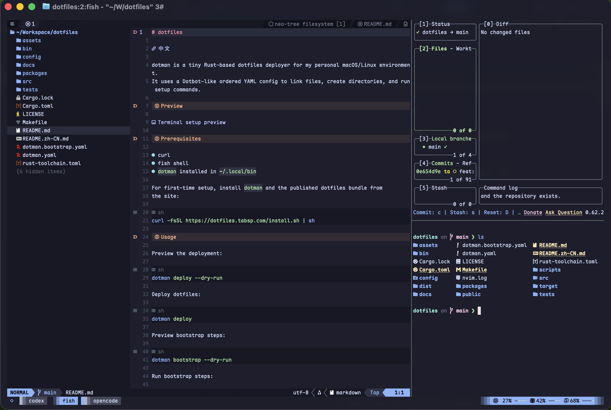

# dotfiles

[English](README.md)

dotman 是一个小型 Rust-based dotfiles 部署工具，用于我的个人 macOS/Linux 环境。
它使用 Dotbot-like 的有序 YAML 配置来链接文件、创建目录并运行设置命令。

## 效果预览



## 前置依赖

- 带 Cargo 的 Rust 工具链
- GNU Make
- Git
- curl
- fish shell

## 使用

构建部署工具：

```sh
make build
```

预览部署计划：

```sh
make deploy DRY_RUN=1
```

部署 dotfiles：

```sh
make deploy
```

预览 bootstrap 步骤：

```sh
make bootstrap DRY_RUN=1
```

运行 bootstrap 步骤：

```sh
make bootstrap
```

跳过 shell 命令，例如插件同步：

```sh
make deploy EXCEPT=shell
```

只运行链接步骤：

```sh
make deploy ONLY=link
```

## 工具

| 工具 | 用途 |
|------|------|
| [fish](https://fishshell.com) | 自带自动补全的 shell |
| [starship](https://starship.rs) | 跨 shell 的提示符 |
| [direnv](https://direnv.net) | 按目录加载环境变量 |
| [mise](https://mise.jdx.dev) | 运行环境和工具版本管理器 |
| [fzf](https://github.com/junegunn/fzf) | 模糊查找（文件、历史、zoxide 跳转） |
| [zoxide](https://github.com/ajeetdsouza/zoxide) | 智能 `cd`，带目录权重排序 |
| [fd](https://github.com/sharkdp/fd) | 快速 `find` 替代 |
| [ripgrep](https://github.com/BurntSushi/ripgrep) | 快速 `grep` 替代 |
| [eza](https://github.com/eza-community/eza) | 现代 `ls` 替代，带图标 |
| [bat](https://github.com/sharkdp/bat) | 带语法高亮的 `cat` |
| [tealdeer](https://github.com/dbrgn/tealdeer) | 快速 `tldr` 客户端 |
| [btop](https://github.com/aristocratos/btop) | 资源监控 |
| [fastfetch](https://github.com/fastfetch-cli/fastfetch) | 系统信息展示 |
| [dua-cli](https://github.com/Byron/dua-cli) | 磁盘使用分析 |
| [neovim](https://neovim.io) | 编辑器 |
| [lazygit](https://github.com/jesseduffield/lazygit) | 终端 Git UI |
| [yazi](https://github.com/sachinsenal/yazi) | 终端文件管理器 |
| [tmux](https://github.com/tmux/tmux) | 终端复用器，Catppuccin 主题 |
| [ghostty](https://ghostty.org) | GPU 加速终端，Catppuccin Mocha 主题 |
| [jq](https://github.com/jqlang/jq) + [yq](https://github.com/mikefarah/yq) | JSON/YAML 命令行处理器 |
| [ruby](https://www.ruby-lang.org) | `try` 实验管理器的运行时 |

所有包在 bootstrap 时通过 `brew bundle --file packages/Brewfile` 安装。Fish 启动时自动集成大部分工具，并定义自定义函数：`zi`（fzf+zoxide 跳转）、`ff`（fzf 文件选择）、`y`（yazi 并自动 cd）、`t`（tmux 附加/创建）。参见 `config/fish/config.fish`。

## 目录结构

- `bin/`：链接到 `~/.local/bin` 的用户脚本（tmux-status 等）
- `config/`：被跟踪的 dotfiles 源文件（fish、nvim、ghostty、btop、fastfetch、starship、tealdeer、tmux、git）
- `docs/`：设置说明和手动清单
- `dotman.yaml`：部署步骤（链接配置、创建目录、同步衍生状态）
- `dotman.bootstrap.yaml`：bootstrap 步骤（安装包、字体）
- `packages/`：Brewfile 和平台相关的安装辅助脚本
- `src/`：Rust 部署工具源码
- `tests/`：CLI 集成测试

## 配置

部署步骤写在 `dotman.yaml` 中。bootstrap 步骤写在
`dotman.bootstrap.yaml` 中。

支持的指令：

- `defaults`
- `link`
- `create`
- `shell`
- `clean`: planned / dry-run placeholder

示例：

```yaml
- defaults:
    link:
      create: true
      relink: true
      relative: true
    shell:
      stdout: true
      stderr: true

- link:
    ~/.config/fish: config/fish
    ~/.config/nvim: config/nvim

- create:
    - ~/.config/fish/local.d

- shell:
    - command: fish -lc 'type -q fisher; or curl -sL https://raw.githubusercontent.com/jorgebucaran/fisher/main/functions/fisher.fish | source; and fisher update'
      description: Sync fish plugins
      optional: true
```

字段说明：

- `defaults.link.create`：为链接目标自动创建缺失的父目录。
- `defaults.link.relink`：目标已是 symlink 但指向不对时，替换为新的链接。
- `defaults.link.backup`：目标冲突时，先备份原目标再创建链接。
- `defaults.link.relative`：创建相对 symlink。
- `defaults.shell.stdout`：默认继承 shell 命令的 stdout。
- `defaults.shell.stderr`：默认继承 shell 命令的 stderr。
- `link`：把目标路径映射到源路径；单个链接项也可以使用 `path`，并覆盖
  `create`、`relink`、`backup`、`relative` 和 `if`。
- `create`：创建目录，并跟随路径中已有的 symlink 组件。
- `shell.command`：通过 `sh -c` 执行的命令。
- `shell.description`：日志中显示的人类可读步骤名称。
- `shell.if`：命令运行前必须成功的 shell 条件。
- `shell.optional`：为 `true` 时，命令失败只记录为 warning，后续步骤继续执行。
  默认是 `false`。
- `shell.stdout` / `shell.stderr`：单条命令的输出覆盖设置。
- `clean`：目前会被解析并在 dry-run 中显示，但非 dry-run 清理尚未实现。

`deploy` 对核心文件操作采用 fail-fast：link/create 失败会停止本次运行。受网络影响的
同步命令可以标记为 `optional: true`，临时失败不会导致整个 deploy 失败。

## 本地覆盖

机器相关的路径、token 和临时工具配置不要放进共享仓库。

fish 会加载本地文件：

```text
~/.config/fish/local.d/*.fish
```

新机器首次设置参考 [docs/new-machine.md](docs/new-machine.md)。

## 开发

```sh
make lint
make test
make ci
```
